# 🚀 Elite Arch Linux Dotfiles

> A meticulously crafted, high-performance development environment powered by Rust tools and modern architecture.

[](https://archlinux.org/)
[](https://neovim.io/)
[](https://www.rust-lang.org/)

---

## 📐 Architecture Overview

This configuration follows a **three-tier architecture** optimizing the workflow between Shell, Multiplexer, and Editor:

```mermaid
flowchart TB
    subgraph Terminal["🖥️ Terminal Layer"]
        Kitty["Kitty Terminal<br/>(GPU-accelerated)"]
    end
    
    subgraph Shell["🐚 Shell Layer (Zsh)"]
        Zsh["Zsh Shell"]
        P10k["Powerlevel10k Theme<br/>(Instant Prompt)"]
        Sheldon["Sheldon Plugin Manager"]
        Defer["zsh-defer<br/>(Async Loading)"]
        
        Zsh --> P10k
        Zsh --> Sheldon
        Sheldon --> Defer
    end
    
    subgraph Tools["🔧 CLI Tools (Rust-Powered)"]
        Zoxide["zoxide<br/>(Smart cd)"]
        Eza["eza<br/>(Modern ls)"]
        Ripgrep["ripgrep<br/>(Fast grep)"]
        Bat["bat<br/>(Better cat)"]
        Fd["fd<br/>(Fast find)"]
        Fzf["fzf<br/>(Fuzzy Finder)"]
    end
    
    subgraph Multiplexer["📺 Multiplexer Layer"]
        Tmux["Tmux"]
        TPM["TPM<br/>(Plugin Manager)"]
        TmuxPlugins["Plugins:<br/>• vim-tmux-navigator<br/>• tmux-yank<br/>• tmux-fzf"]
        TmuxSessionizer["tmux-sessionizer<br/>(Project Switcher)"]
        
        Tmux --> TPM
        TPM --> TmuxPlugins
        Tmux --> TmuxSessionizer
    end
    
    subgraph Editor["✏️ Editor Layer"]
        Neovim["Neovim"]
        Lazy["lazy.nvim<br/>(Plugin Manager)"]
        LSP["LSP Servers:<br/>• rust-analyzer<br/>• clangd<br/>• jdtls<br/>• typescript-language-server"]
        Telescope["Telescope<br/>(Fuzzy Finder)"]
        Treesitter["Treesitter<br/>(Syntax Highlighting)"]
        
        Neovim --> Lazy
        Lazy --> LSP
        Lazy --> Telescope
        Lazy --> Treesitter
    end
    
    Kitty --> Zsh
    Zsh --> Tools
    Zsh --> Tmux
    Tmux --> Neovim
    Neovim -.->|vim-tmux-navigator| Tmux
    Fzf -.->|Integration| Tmux
    Telescope -.->|Uses| Ripgrep
    TmuxSessionizer -.->|Uses| Fzf
    
    style Kitty fill:#f9f,stroke:#333,stroke-width:2px
    style Zsh fill:#9f9,stroke:#333,stroke-width:2px
    style Tmux fill:#99f,stroke:#333,stroke-width:2px
    style Neovim fill:#f99,stroke:#333,stroke-width:2px
    style Tools fill:#ff9,stroke:#333,stroke-width:2px
```



---

## 🧩 Component Breakdown

### 🐚 Shell Configuration (Zsh)

#### **Main Config** (`zsh/.zshrc`)
- **Lines 1-8**: Powerlevel10k instant prompt initialization for blazing-fast shell startup
- **Lines 10-17**: Optimized `compinit` with 24-hour cache check to reduce shell startup time
- **Lines 19-21**: Sheldon plugin manager initialization with async defer support
- **Lines 28-32**: History configuration with 1M entries, shared across sessions, and duplicate removal
- **Lines 34-38**: FZF integration with custom keybindings (`Ctrl+R` for history, `Ctrl+T` for files)
- **Lines 40-54**: Elite compinit setup with compiled `.zwc` files for maximum performance
- **Lines 55-93**: Vi mode configuration with visual cursor feedback (block in normal, beam in insert)
- **Lines 96**: FNM (Fast Node Manager) initialization with auto-version switching
- **Lines 106**: Zoxide (smart `cd` replacement) initialization

#### **Plugin Management** (`zsh/plugins.toml`)
Uses **Sheldon** for declarative plugin management:
- **zsh-defer**: Async plugin loading framework
- **Powerlevel10k**: High-performance prompt (loaded immediately)
- **zsh-autosuggestions**: Fish-like autosuggestions (deferred)
- **zsh-syntax-highlighting**: Command syntax validation (deferred, loaded last)
- **fzf-tab**: Tab completion with fuzzy finder (deferred)
- **OMZ plugins**: Git, Docker, Conda plugins loaded as raw files (deferred)

#### **Aliases & Functions** (`zsh/aliases.zsh`)

| Alias/Function | Command | Description |
|----------------|---------|-------------|
| **Navigation** | | |
| `ls` | `eza --icons --group-directories-first` | Modern `ls` with icons and directory grouping |
| `ll` | `eza -l --icons --git --header --total-size` | Long listing with git status and size info |
| `lt` | `eza --tree --level=2 --icons` | Tree view (2 levels deep) |
| `..` | `cd ..` | Navigate up one directory |
| `...` | `cd ../..` | Navigate up two directories |
| `mkcd` | `mkdir -p "$1" && cd "$1"` | Create directory and enter it |
| **File Operations** | | |
| `e` / `v` | `nvim` | Open Neovim |
| `cp` | `cp -i` | Interactive copy (confirm overwrites) |
| `mv` | `mv -i` | Interactive move |
| `rm` | `rm -I` | Safer remove (confirm if >3 files) |
| **Arch Linux (Package Management)** | | |
| `upd` | `update_clean` | Full system update + cleanup (see below) |
| `in` | `yay -S` | Install package |
| `rem` | `yay -Rns` | Remove package with dependencies |
| `orphan` | `yay -Rns $(yay -Qtdq)` | Remove orphaned packages |
| `please` | `sudo $(fc -ln -1)` | Re-run last command with sudo |
| **Development (Rust)** | | |
| `c` | `cargo` | Cargo shorthand |
| `cr` | `cargo run` | Run Rust project |
| `ct` | `cargo test` | Run tests |
| `cb` | `cargo build` | Build project |
| `ck` | `cargo check` | Check code without building |
| `cw` | `cargo watch -x run` | Auto-rebuild on file change |
| `cl` | `cargo clippy` | Run linter |
| `cx` | `cargo run --example` | Run example |
| **C++ Competitive Programming** | | |
| `cpprun` | `g++ -O3 -std=c++23 -Wall -Wextra` | Compile and run with optimizations |
| `cpp_debug` | `g++ -g -fsanitize=address,undefined` | Debug build with sanitizers |
| **Utilities** | | |
| `lg` | `lazygit` | Git TUI |
| `ld` | `lazydocker` | Docker TUI |
| `ts` | `tmux-sessionizer` | Smart tmux session switcher |
| `myip` | `curl http://ipecho.net/plain` | Get public IP |
| `p` | `pass` | Password manager |
| `img` | `fd -e jpg -e png \| nsxiv -itfa` | View images in current directory |

#### **Custom Functions**

**`update_clean()`** (`zsh/upclean.zsh`)  
Comprehensive Arch Linux system maintenance:
1. Refreshes Arch keyring
2. Updates official repos + AUR packages
3. Prunes orphaned dependencies
4. Cleans package cache (keeps last 2 versions)
5. Removes AUR build artifacts
6. Logs all operations to `~/.local/state/upclean/update_history.log`

**`extract()`** (`zsh/extract.zsh`)  
Universal archive extractor supporting:
- `tar.gz`, `tar.bz2`, `tar.xz`, `tar`
- `zip`, `jar`
- `7z`, `rar`
- `gz`, `bz2`, `xz`

### 📺 Tmux Configuration (`.tmux.conf`)

#### **General Settings** (Lines 1-16)
- **Prefix Key**: `Ctrl+A` (instead of default `Ctrl+B`)
- **Mouse Support**: Enabled for pane resizing and scrolling
- **Base Index**: 1 (easier to reach on keyboard)
- **Escape Time**: 0ms (instant Vim mode switching)
- **History**: 50,000 lines

#### **Terminal & Colors** (Lines 21-24)
- **Terminal**: `tmux-256color` with true color support
- **Overrides**: Ensures proper color display in Kitty and other modern terminals

#### **Key Bindings** (Lines 26-37)

| Keybinding | Action |
|------------|--------|
| `Prefix + r` | Reload tmux config |
| `Prefix + \|` | Split window vertically |
| `Prefix + -` | Split window horizontally |
| `Prefix + x` | Kill pane (no confirmation) |
| `Prefix + Ctrl+S` | Session switcher |
| `Prefix + h/j/k/l` | Navigate panes (Vim-style) |

#### **Plugins** (Lines 39-44)
- **TPM**: Plugin manager
- **tmux-sensible**: Sensible defaults
- **tmux-yank**: Copy to system clipboard
- **vim-tmux-navigator**: Seamless Vim/Tmux pane navigation with `Ctrl+h/j/k/l`
- **tmux-fzf**: Fuzzy finder integration

#### **Theme** (Lines 46-72)
Hybrid Gruvbox × Catppuccin theme:
- **Background**: `#1e1e2e` (Catppuccin Mocha)
- **Accent**: `#fb4934` (Gruvbox Red)
- **Text**: `#cdd6f4` (Catppuccin Text)
- **Active Border**: Gruvbox Red
- **Inactive Border**: Subtle gray

### ✏️ Neovim Configuration (`nvim/init.lua`)

#### **Plugin Manager**: lazy.nvim (Lines 185-199)
Modern, performance-focused plugin manager with lazy loading.

#### **Core Settings** (Lines 12-99)
- **Clipboard**: System clipboard integration
- **Line Numbers**: Enabled with relative numbers
- **Mouse**: Enabled for all modes
- **Undo**: Persistent undo history
- **Search**: Smart case-insensitive search
- **Splits**: Open right/below by default
- **Scrolloff**: 10 lines of context

#### **Key Mappings** (Lines 106-146)

| Keybinding | Mode | Action |
|------------|------|--------|
| `Space` | Normal | Leader key |
| `Esc` | Normal | Clear search highlights |
| `Alt+W` | Normal | Save file |
| `Alt+Q` | Normal | Force quit |
| `Alt+E` | Normal | Open file explorer |
| `Alt+S` | Normal | Vertical split |
| `Ctrl+H/J/K/L` | Normal | Navigate splits (vim-tmux-navigator) |
| `jk` | Insert | Exit to normal mode (Vim mode) |
| `Ctrl+R` | Normal/Insert | FZF history search |
| `vv` | Normal (Vim mode) | Edit command in Neovim |

#### **Key Plugins**

| Plugin | Purpose | Config Location |
|--------|---------|-----------------|
| **lazy.nvim** | Plugin manager | `init.lua:185-199` |
| **Telescope** | Fuzzy finder (files, grep, LSP) | `custom/plugins/init.lua` |
| **Treesitter** | Syntax highlighting | `init.lua` (kickstart) |
| **LSP** | Language servers | `init.lua` (kickstart) |
| **rustaceanvim** | Rust tooling | `custom/plugins/rustaceanvim.lua` |
| **jdtls** | Java LSP | `custom/plugins/jdtls.lua` |
| **conform.nvim** | Code formatting | `custom/plugins/conform.lua` |
| **nvim-dap** | Debugger (C++, Rust) | `custom/plugins/dap-cpp.lua` |
| **lazygit.nvim** | Git TUI integration | `custom/plugins/lazygit.lua` |
| **harpoon** | Quick file navigation | `custom/plugins/harpoon.lua` |
| **catppuccin** | Color scheme | `custom/plugins/catppuccin.lua` |
| **dashboard-nvim** | Start screen | `custom/plugins/dashboard-nvim.lua` |
| **toggleterm** | Terminal integration | `custom/plugins/toggleterm.lua` |
| **leetcode.nvim** | LeetCode integration | `custom/plugins/leetcode.lua` |
| **vim-tmux-navigator** | Seamless tmux navigation | `custom/plugins/vimTmuxnaviga.lua` |

### 🛠️ Custom Scripts (`bin/`)

| Script | Purpose |
|--------|---------|
| `tmux-sessionizer` | FZF-based tmux session manager (inspired by ThePrimeagen) |
| `yay-fzf-install` | Interactive package installer with fuzzy search |
| `yay-fzf-remove` | Interactive package remover |
| `pacman-fzf-install` | Official repo package installer |
| `i3-tmux-launcher` | Launch tmux from i3 window manager |
| `charpicker` | Emoji/special character picker |
| `open-term-same-dir` | Open terminal in current directory |

### 🎨 Additional Configurations

- **Kitty** (`kitty/`): GPU-accelerated terminal with Gruvbox theme
- **i3** (`i3/`): Tiling window manager config
- **Sway** (`sway/`): Wayland compositor config
- **Zathura** (`zathura/`): Vim-like PDF viewer
- **MPD** (`mpd/`): Music Player Daemon
- **Dunst** (`dunst/`): Notification daemon
- **Picom** (`picom/`): X11 compositor for transparency

---

## ⚡ Performance Optimizations

### Shell Startup Performance
1. **Powerlevel10k Instant Prompt**: Sub-40ms prompt display
2. **Sheldon with zsh-defer**: Async plugin loading (no blocking)
3. **Compiled Completion Cache**: `.zwc` files for faster loading
4. **Conditional Compinit**: Only regenerates cache every 24 hours

### Neovim Startup Performance
1. **lazy.nvim**: Lazy loads plugins on-demand
2. **Treesitter**: Incremental parsing (only updates changed nodes)
3. **LSP**: Auto-configured with sensible defaults

### Tmux Performance
1. **Escape Time**: 0ms for instant mode switching
2. **Base Index**: 1 (reduces cognitive load)
3. **Plugin Manager**: TPM for modular plugin loading

---

## 🚀 Installation

### Prerequisites
```bash
# Install base tools
sudo pacman -S zsh tmux neovim git fzf ripgrep fd bat eza zoxide kitty

# Install AUR helper (yay)
git clone https://aur.archlinux.org/yay.git && cd yay && makepkg -si

# Install additional tools
yay -S sheldon fnm lazygit lazydocker
```

### Setup
```bash
# Clone repository
git clone https://github.com/Sharmaharshitnone/config.git ~/.config-backup
cd ~/.config-backup

# Symlink configurations
ln -sf ~/.config-backup/zsh ~/.config/zsh
ln -sf ~/.config-backup/nvim ~/.config/nvim
ln -sf ~/.config-backup/.tmux.conf ~/.tmux.conf
ln -sf ~/.config-backup/kitty ~/.config/kitty
ln -sf ~/.config-backup/bin ~/.local/bin

# Source Zsh environment
echo 'source ~/.config/zsh/.zshenv' >> ~/.zshenv

# Install Tmux plugins
git clone https://github.com/tmux-plugins/tpm ~/.tmux/plugins/tpm
# In Tmux: Prefix + I to install plugins

# Install Zsh plugins
sheldon lock --update

# Change default shell
chsh -s $(which zsh)
```

### First Launch
1. **Zsh**: Run `p10k configure` to customize your prompt
2. **Neovim**: Run `:Lazy sync` to install all plugins
3. **Tmux**: Press `Prefix + I` to install plugins

---

## 📊 Tech Stack

### Core
- **OS**: Arch Linux
- **Shell**: Zsh
- **Multiplexer**: Tmux
- **Editor**: Neovim
- **Terminal**: Kitty

### Rust-Powered Tools
- **eza**: Modern `ls` replacement
- **ripgrep**: Fast grep alternative
- **bat**: `cat` with syntax highlighting
- **fd**: User-friendly `find`
- **zoxide**: Smart directory jumper
- **tokei**: Code statistics
- **fnm**: Fast Node Manager

### Development
- **LSP**: Language server protocol for intelligent code editing
- **Treesitter**: Advanced syntax highlighting
- **DAP**: Debug Adapter Protocol
- **lazygit**: Git TUI
- **lazydocker**: Docker TUI

---

## 🎯 Keybinding Cheatsheet

### Shell (Zsh)
| Keybinding | Action |
|------------|--------|
| `Ctrl+R` | FZF history search |
| `Ctrl+T` | FZF file finder |
| `jk` (Vi mode) | Exit insert mode |
| `vv` (Vi mode) | Edit command in Neovim |

### Tmux
| Keybinding | Action |
|------------|--------|
| `Ctrl+A` | Prefix key |
| `Prefix + c` | New window |
| `Prefix + \|` | Split vertical |
| `Prefix + -` | Split horizontal |
| `Prefix + h/j/k/l` | Navigate panes |
| `Ctrl+H/J/K/L` | Navigate panes/Vim (seamless) |
| `Prefix + Ctrl+S` | Session switcher |

### Neovim
| Keybinding | Action |
|------------|--------|
| `Space` | Leader key |
| `Space + sf` | Find files (Telescope) |
| `Space + sg` | Live grep (Telescope) |
| `Space + sh` | Help tags (Telescope) |
| `Alt+W` | Save file |
| `Alt+E` | File explorer |
| `jk` | Exit insert mode (Vi mode) |

---

## 📚 Resources

- [Zsh Documentation](https://zsh.sourceforge.io/Doc/)
- [Tmux Manual](https://man.openbsd.org/tmux.1)
- [Neovim Documentation](https://neovim.io/doc/)
- [lazy.nvim](https://github.com/folke/lazy.nvim)
- [Powerlevel10k](https://github.com/romkatv/powerlevel10k)
- [Sheldon](https://github.com/rossmacarthur/sheldon)

---

## 🤝 Contributing

Feel free to fork this repository and customize it to your needs. If you have suggestions for improvements, open an issue or pull request!

---

## 📝 License

MIT License - See LICENSE file for details

---

<div align="center">
  <sub>Built with ❤️ for the Arch Linux community</sub>
</div>
